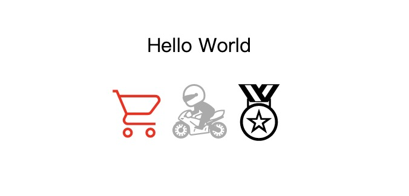

# weapp-svg-icon

基于 [Iconify](https://iconify.design/) 实现的微信小程序图标组件，
主要用到了 @antfu 的 [Icons in Pure CSS](https://antfu.me/posts/icons-in-pure-css) 解决方案。

[](./image.jpg)

## How to use

复制该项目里的 miniprogram/utils/svgIcon.ts 和 miniprogram/components/svg-icon 至你的项目，在 app.json 全局注册 svg-icon 组件，然后就可以在任意页面或组件使用该组件了。

```
// app.json or any index.json
"usingComponents": {
  "svg-icon": "/components/svg-icon/index"
},
```

```
// any index.wxml
<svg-icon name="mdi-light:cart" size="50px" color="red" />
```

## Component properties

| Name           | Type             | Default          | Description |
| -------------- | :--------------: | :--------------: | -------------- |
| name           | String           | ''               | name of icon, format: 'set-name:icon-name' |
| color          | String           | ''               | color of icon, such as 'red' or '#aaaaaa' |
| size           | String           | '1em'            | size of icon, unit can be em \| px \| rpx |

- icon name is based on the format of iconify such as 'mdi-light:chart-areaspline'


## About svg data

svg 数据有三种方式可以获取:

- 在 svgIcon.ts 文件里面直接自定义任意 svg 数据:
  
  ```
  const customerSvg: Record<string, string> = {
    CarbonSortAscending: '<svg xmlns="http://www.w3.org/2000/svg" xmlns:xlink="http://www.w3.org/1999/xlink" aria-hidden="true" role="img" class="iconify iconify--carbon" width="32" height="32" preserveAspectRatio="xMidYMid meet" viewBox="0 0 32 32"><path fill="currentColor" d="m18 22l1.414-1.414L23 24.172V4h2v20.172l3.586-3.586L30 22l-6 6l-6-6zM2 18h14v2H2zm4-6h10v2H6zm4-6h6v2h-6z"></path></svg>',
  }
  ```
  ```
  <svg-icon name="carbon:sort-ascending" size="50rpx" color="red" />
  ```
  数据格式:
  - key - format: 'SetNameIconName', such as 'CarbonSortAscending'
  - value - svg data, you can get it from [icones](https://icones.netlify.app/) or [iconify](https://iconify.design/)

  优缺点:
  - 优点: 打包数据量小
  - 缺点: 有点麻烦

- 引用 @iconify-json npm 包
  
  iconify 提供了100+图集和10000+图标，每个图集都有对应的 npm 包，例如: @iconify-json/mdi-light

  安装并引用 npm 包：

  ```
  // svgIcon.ts
  import MdiLight from '@iconify-json/mdi-light'
  const iconifyPresets: Record<string, IconifyData> = {
    MdiLight
  }
  ```
  可以用该图集下的任意图标，例如：
  ```
  <svg-icon name="mdi-light:cart" size="50px" color="red" />
  ```

  优缺点:
  - 优点: 省事
  - 缺点: 打包数据量大，不能做到 tree shaking

- 用 Iconify Hosting Api

  这种方法需要有自己的后端服务器提供 svg 数据。

  步骤:
  - 服务器搭建 [Nodejs](https://docs.iconify.design/api/hosting-js/) [PHP](https://docs.iconify.design/api/hosting-php/)
  - 小程序初始化

    ```
    // app.ts
    import { iconifySetup } from './utils/svgIcon'
    onLaunch() {
      ...
      iconifySetup('http://localhost:3000/svg/iconify') // modify to your own api
      ...
    }
    ```
  - 在页面中使用 iconify 任意图集的任意图标:

    ```
    <svg-icon name="twemoji:1st-place-medal" size="50px" />
    ```
  
  - 由于图标不在本地，第一次加载图标可能会有延迟，可以设置 preload，图标加载过后会存储到 storage 后面加载就没有问题了

    ```
    // svgIcon.ts
    const iconifyPreload: string[] = [
      'carbon:portfolio',
    ]
    ```

  优缺点:
  - 优点: 方便，非常的方便，不会有多余的打包数据，可以用 iconify 下的任意图标
  - 缺点: 需要自己搭建服务器后端

总结

如果小程序使用图标数量不多或者需要自定义的 svg 可以使用第一种方法。

第二种方法主要是打包体积会存在问题，如有自己的分包方案可以使用此方法。

如果有多个小程序项目或者图标数量较多的情况可以使用第三种方法，真的是一劳永逸。


## Thanks

- [@antfu](https://github.com/antfu) - vue 生态圈比较火的大佬，很多有意思的项目。
- [@iconify](https://github.com/iconify) - iconify 真的太方便了，大感谢。

## License

[MIT](./LICENSE) License © 2022-Present [Alex](https://github.com/LarchLiu)


